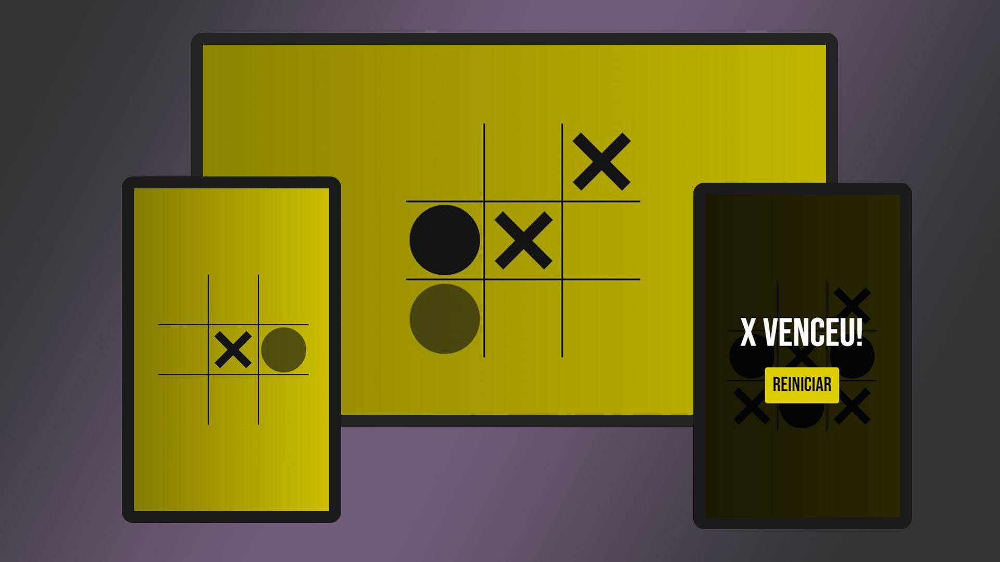

# jogo-da-velha

<h1 align="center"> Jogo da Velha </h1>

Clássico jogo da velha criado com JavaScript.

 

  

## 🚀 Tecnologias

Esse projeto foi desenvolvido com as seguintes tecnologias:

- HTML e CSS
- JavaScript
- Git e Github

## 💻 Projeto

Jogo da velha criado com base no canal 'dicasparadevs'. Aprimoramento autoral do CSS. Projeto destinado para estudo da programação, abrangendo conceitos de array, variáveis e funções.

## ☝️ Desenvolvimento

Com o intuito de recorrer a projetos mais complexos com a finalidade de estudo, o Jogo da Velha foi tido como parâmetro de programação, eis que possui conceitos mais avançados com funções e combinações de vitória através dos arrays. Operadores ternários e estruturas de condição if/else compuseram a estruturação do JavaScript. Com o HTML enxuto, foi possível restringir o uso do CSS, tornando um código limpo e responsivo.